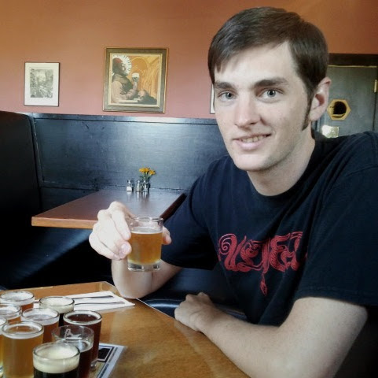

Title: ixjlyons
URL:
save_as: index.html

<figure style="float: right">
    
</figure>

Hello, I'm Kenneth Lyons.

I am a PhD student in the Mechanical and Aerospace Engineering department at UC
Davis. I work in the [Robotics, Autonomous Systems, and Controls Laboratory
(RASCAL)](https://research.engineering.ucdavis.edu/rascal/), where I develop
ways for humans to control machines.

* [curriculum vitae](https://www.dropbox.com/s/49t8ne7wbfsr0ni/cv.pdf?dl=1)
